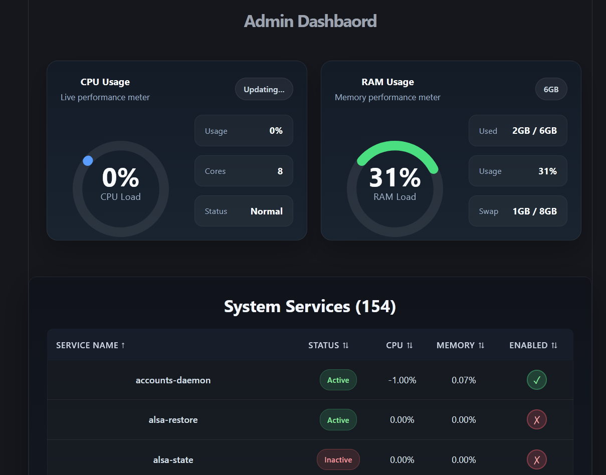

# Simple Home Lab Dashboard
Simple server dashboard built with React.  
It displays server information such as CPU usage, memory usage, and disk space. The dashboard is responsive and can be accessed from any device.
 

### IMPORTANT! THE DASHBOARD ISN'T OPTIMIZED AND NOT SECURED, IT'S JUST A PROOF OF CONCEPT. IT MEANT FOR EDUCATIONAL PURPOSE ONLY.

